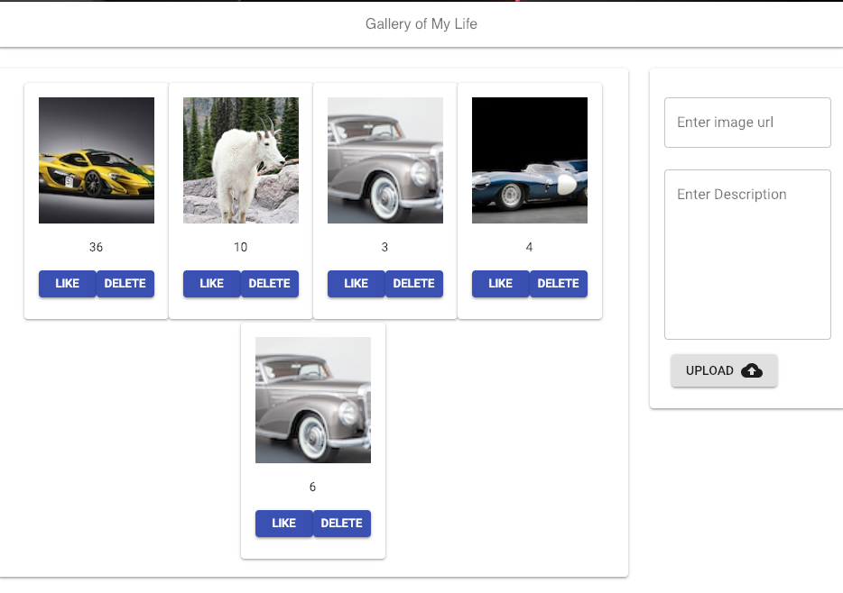

## Photo Gallery Application 

This is an app that will display photos and allow the user to add photos to the page.
The user can click on a photo and get a description, user can like a photo, as well as delete a photo.

### Built With...
* JavaScript
* React.js
* Redux
* Postico/PostgreSQL
* Node
* Express
* HTML/CSS

### Website will look like...
